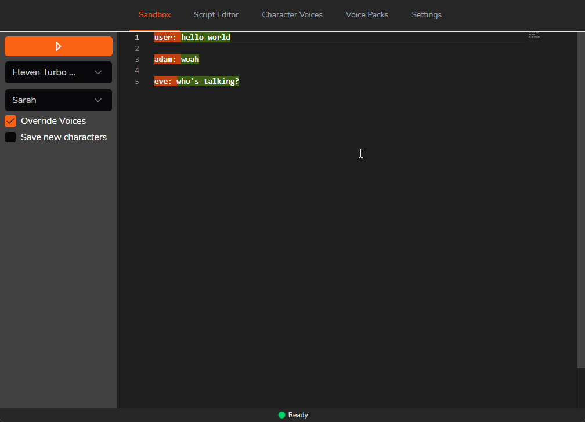

# Narration Studio

## About

Give a voice to everyone & everything! Games, software, videos.
A tool that unifies many different text-to-speech engines into one graphical user interace. Create scripts, try out TTS engines, and more coming soon.
At the moment only basic capabilities are enabled for each engine, but the plan is to integrate all of the features available for each.

The objective of this project is to provide a nice interface to use many TTS engines simultaneously. The next step will be providing an easy way to enable TTS in any game or software,
and if it's feasible to provide OCR capabilities to enable it in games that aren't easily moddable.

Built in Go using [wails.io](https://wails.io), Vue + Typescript.

## Features

* Local & API TTS engines
* Create & Modify audio scripts 
* Preview TTS engines and their available voices

## Currently Supported TTS Engines:

* [Piper](https://github.com/rhasspy/piper)
* [Microsoft Speech Api 4 (Windows Only)](https://en.wikipedia.org/wiki/Microsoft_Speech_API)
* [ElevenLabs](https://elevenlabs.io/docs/api-reference/text-to-speech)
* [OpenAI TTS](https://platform.openai.com/docs/guides/text-to-speech)

### _Upcoming Features:_
* Server mode to provide TTS through http
* Command line mode to provide TTS through stdio
* Twitch, Kick integration for streaming
* OCR to TTS
* TBA

## Live Development

To run in live development mode, run `wails dev` in the project directory. This will run a Vite development
server that will provide very fast hot reload of your frontend changes. If you want to develop in a browser
and have access to your Go methods, there is also a dev server that runs on http://localhost:34115. Connect
to this in your browser, and you can call your Go code from devtools.

## Building

To build a redistributable, production mode package, use `wails build`.
